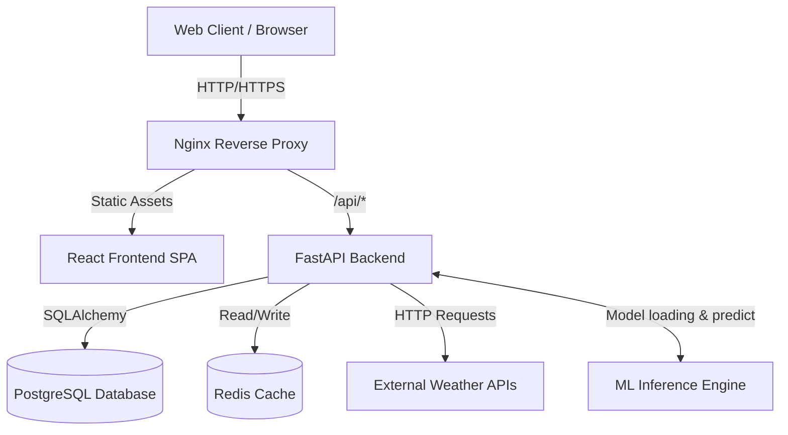

# Architecture Documentation

## System Overview

## Component Descriptions

1. **Frontend (React + Vite)**: Provides the user interface, including a CesiumJS Earth visualization and Canvas fallback. Hosted as static files behind Nginx in production.
2. **Backend (FastAPI)**: Serves RESTful APIs. Manages business logic, authentication, input validation, and orchestrates calls to external providers and ML models.
3. **Database (PostgreSQL)**: Stores user preferences, saved locations, search history, and cached historical weather data for ML training.
4. **Cache (Redis)**: Caches external API responses to reduce latency and API usage costs.
5. **ML Engine**: Scikit-learn/XGBoost pipelines loaded in-memory to provide enhanced micro-climate predictions.

## Data Flow
- **Weather Query**: Client requests weather -> Backend checks Redis -> (If miss) Fetch from Open-Meteo -> Save to Redis -> Return to client.
- **Chat Query**: Client sends text -> Backend parses intent (Rule-based or LLM) -> Determines location & date -> Invokes Weather Query flow -> Formats response -> Returns to client.

## Technology Choices
- **FastAPI**: Chosen for its high performance, native async support, and auto-generated OpenAPI docs.
- **PostgreSQL**: Robust, highly scalable relational database.
- **Redis**: Essential for rate-limiting and caching high-volume weather API responses.

## Scalability Considerations
- The backend is stateless (except for Redis/DB interactions), allowing it to scale horizontally.
- Nginx effectively handles static file delivery and acts as a load balancer for backend nodes.
