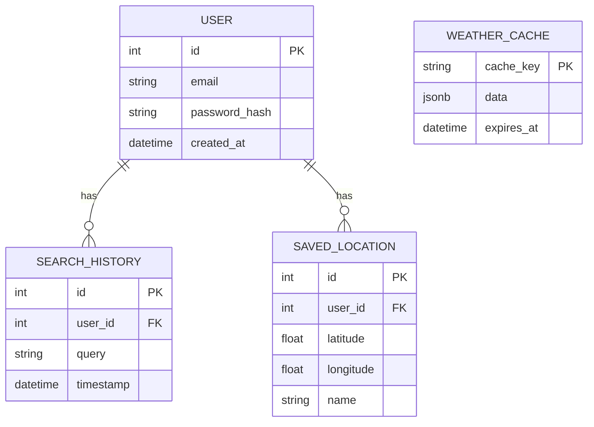

# Database Documentation

## ER Diagram

## Tables Details

### `users` (Planned)
- `id`: Primary Key, Auto-increment
- `email`: String, Unique, Indexed
- `password_hash`: String
- `created_at`: Timestamp

### `saved_locations`
- `id`: Primary Key, Auto-increment
- `user_id`: Foreign Key referencing `users(id)`
- `latitude`: Float
- `longitude`: Float
- `name`: String (e.g., "Home", "Work")

### `weather_cache`
Stores raw JSON responses from external providers to minimize API calls.
- `cache_key`: String (e.g., "current_51.5_-0.12")
- `data`: JSONB (PostgreSQL) or JSON string (SQLite)
- `expires_at`: Timestamp for TTL

## Indexes
- Index on `saved_locations(user_id)` for fast lookups.
- Index on `weather_cache(expires_at)` for cleanup jobs.

## Migration Guide
We use **Alembic** for database migrations.
- Create migration: `alembic revision --autogenerate -m "description"`
- Apply migration: `alembic upgrade head`
- Rollback: `alembic downgrade -1`
