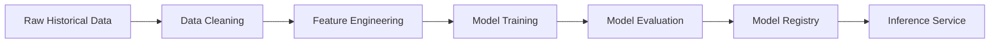

# Machine Learning Workflow

## Pipeline Overview

## Data Sources
- Historical weather data from NOAA and Open-Meteo archive.
- Features include: Temperature, Humidity, Pressure, Wind Speed/Direction, Season, Time of Day.

## Feature Engineering
1. **Missing Values**: Imputed using rolling averages for continuous variables.
2. **Cyclical Encoding**: Time of day and Day of year are converted to Sine/Cosine pairs to preserve cyclical nature.
3. **Lag Features**: Previous 3, 6, and 12-hour values are used as predictors for the current target.

## Models
1. **Random Forest**: Good baseline, handles non-linear relationships well.
2. **XGBoost**: High performance, handles sparse data efficiently.
3. **LightGBM**: Faster training speed, great for large historical datasets.

## Training Process
- Split: 80% train, 20% test (Time-series split, no future leakage).
- Hyperparameter tuning using Grid Search / Random Search.
- Models serialized using `joblib`.

## Evaluation Metrics
- **MAE** (Mean Absolute Error): Primary metric for temperature prediction.
- **RMSE** (Root Mean Squared Error): Penalizes larger prediction errors heavily.

## Prediction Workflow
When a user requests a forecast, the backend API fetches the standard provider forecast, runs our ML models using current observations as input, and blends the predictions.

## Model Versioning & Retraining
- Models are stored in `ml_models/` with timestamps (e.g., `xgboost_v1.2.joblib`).
- Retraining is triggered weekly via a cron job pulling the latest historical data.
