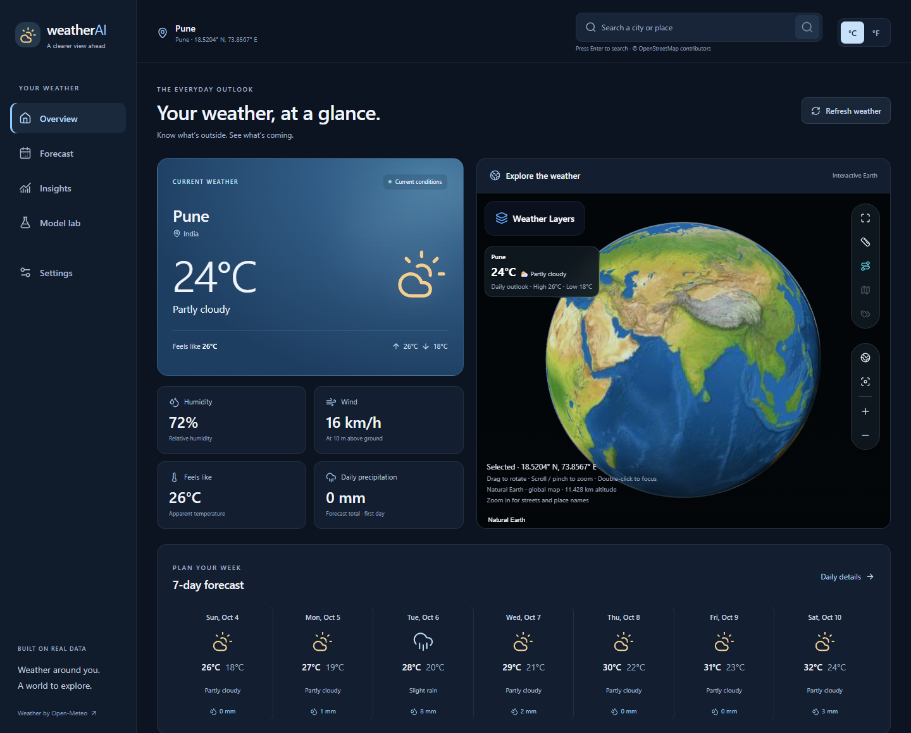

# Weather interface

The React/TypeScript interface puts current conditions and daily forecasts first while retaining the Cesium Earth, street detail, place search, weather layers, measurement tools and Canvas fallback.

- **Overview:** search a place, view its conditions, humidity, wind, apparent temperature and first-day precipitation total, then open any forecast day. The Earth is beside the conditions on desktop and below the forecast on mobile.
- **Forecast:** daily high/low chart, selectable dates and precipitation totals for the same location. The API currently supplies daily data, so the interface does not invent hourly conditions or rain probabilities.
- **Insights:** warmest day, total precipitation, days with at least 1 mm, and a daily precipitation chart calculated from that forecast.
- **Model lab:** recorded sixteen-city ERA5 evaluation results and July 2025 examples. Filter the city error list or select a city to inspect its historical prediction and ERA5 actual values. These are historical research results, not live model inference. All research metrics keep their original units.
- **Settings:** persistent unit preferences and source/imagery information. The demo assistant, fake notifications, nonworking theme selector and training buttons are no longer exposed in the interface.

Search is submitted explicitly (Enter or Search), works on every page, and preserves Nominatim attribution. Current weather and forecast requests stay keyed by coordinates. Loading, unavailable, empty and failed-refresh states are distinct. On mobile the five main destinations are in a bottom navigation bar. Keyboard focus, skip navigation and reduced-motion preferences are supported.

## Screenshots

Screenshots below use deterministic test weather fixtures. The model lab shows the actual recorded research metrics.



[Mobile forecast](screenshots/weather-forecast-mobile.png) · [Model lab](screenshots/weather-model-lab.png)

## Run locally (PowerShell)

From the repository root, start the backend in one terminal:

```powershell
cd backend
# First setup only:
python -m venv .venv
.\.venv\Scripts\python.exe -m pip install -r requirements.txt
# On subsequent runs, only this command is needed:
.\.venv\Scripts\python.exe -m uvicorn app.main:app --host 127.0.0.1 --port 8000
```

Start the frontend in another terminal:

```powershell
cd frontend
npm ci
npm run dev -- --host 127.0.0.1 --port 4173
```

Open http://127.0.0.1:4173/. The Vite development server proxies `/api` to the backend. Natural Earth works without keys. Weather and submitted place searches need network access; Esri remains optional. See [Interactive Earth](interactive-earth.md) for map setup and attribution.

## Check the change

From `frontend`:

```powershell
npm run build
npm test
npm run test:e2e
```

The browser tests stub weather and map tile responses, so automated tests do not depend on live providers or exercise OSM's public tile servers. They cover desktop/mobile layout, selected-day navigation, conversions and persistence, failed/empty data, search dismissal, research examples, and the existing globe controls/fallback.

## Research snapshot provenance

`frontend/src/data/model-evaluation.json` is a display snapshot extracted from `ml/reports/era5_india_8_24h/report.json` and `inference_examples.json` at training commit `f7ea9f7f8d51b2a4be29362585c12455930b8262` ([training PR](https://github.com/dakshsomnathe17-ship-it/Weather-Perdiction/pull/3)). It records the source commit/path, completion date, model and baseline errors, per-city results and verified examples. No fitted model binaries or training datasets are included in the frontend.

To update the snapshot, run the importer from `frontend`, pointing to the completed report directory and its full Git commit SHA:

```powershell
node scripts/import-model-evaluation.mjs <report-directory> <source-commit-sha>
```

The importer checks completed training, validation-based selection, verified model/city coverage, finite scores and historical examples before writing the snapshot. Keep the historical label unless a separately validated live inference service is connected. The linked model card includes the split protocol, prior evaluation exposure, feature precision, limitations and ERA5/Open-Meteo attribution.

UI changes build on the Cesium branch; review this feature against `feat/cesium-earth` so the weather interface diff is separate from the Earth implementation.
