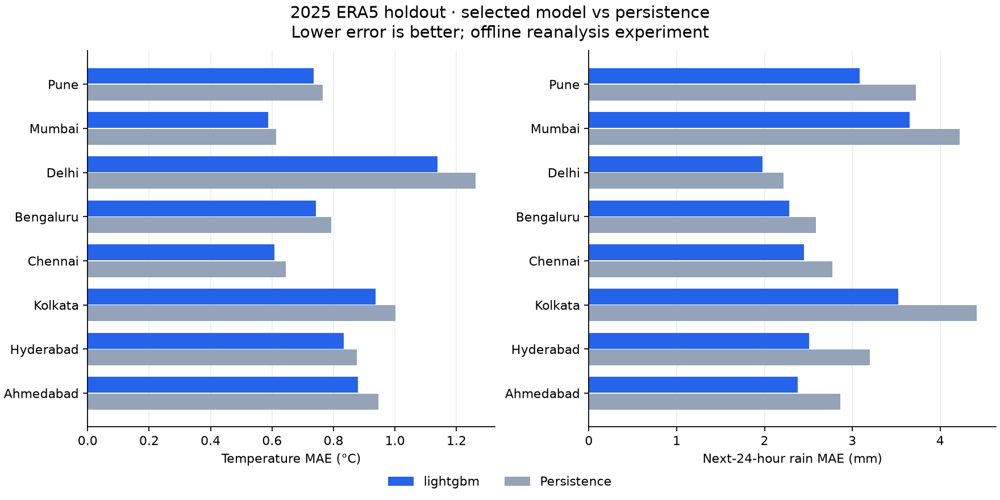

# ERA5 24-hour model card

Run started: 2026-09-30T16:50:42.687044+00:00. Completed: 2026-09-30T17:17:45.064249+00:00.

**Status: research hindcast; not deployed to the website.**

## Data and scope

771,456 hourly records, 2015-01-01 through 2025-12-31 UTC, for 8 cities: Pune, Mumbai, Delhi, Bengaluru, Chennai, Kolkata, Hyderabad, Ahmedabad. 88 annual chunks; 0 missing field values in provider responses. 771,072 complete supervised rows remain after feature/target preparation.

Source: ERA5 processed and distributed by Open-Meteo, explicitly selected with `models=era5`. Requests use the nearest grid cell, UTC, and `elevation=nan` to disable statistical elevation downscaling. This is not a direct CDS download. The models use requested city coordinates; returned coordinates identify the source grid cells.

| City | Requested latitude, longitude | Returned ERA5 grid latitude, longitude |
| --- | --- | --- |
| Pune | 18.5204, 73.8567 | 18.5, 73.75 |
| Mumbai | 19.076, 72.8777 | 19.0, 73.0 |
| Delhi | 28.6139, 77.209 | 28.5, 77.25 |
| Bengaluru | 12.9716, 77.5946 | 13.0, 77.5 |
| Chennai | 13.0827, 80.2707 | 13.0, 80.25 |
| Kolkata | 22.5726, 88.3639 | 22.5, 88.25 |
| Hyderabad | 17.385, 78.4867 | 17.5, 78.5 |
| Ahmedabad | 23.0225, 72.5714 | 23.0, 72.5 |

CSV SHA-256: `794d3da182867ebe2969cb2cacc064332c9fe2eb4735d16a220bd5bb951105c9`.

Attribution: Contains modified Copernicus Climate Change Service information; processed by Open-Meteo. [ERA5 dataset DOI](https://doi.org/10.24381/cds.adbb2d47), [Open-Meteo documentation](https://open-meteo.com/en/docs/historical-weather-api), [CC BY 4.0 and API access terms](https://open-meteo.com/en/terms). Full requests, dates, units and checksums are in [data_manifest.json](data_manifest.json).

## Evaluation protocol

43 features use observations up to the issue hour: six current variables, coordinates, 1/6/24-hour lags, trailing 6/24-hour means, preceding-day rainfall, and known target-time calendar encodings. Targets are five instantaneous values at +24 hours and the next 24-hour precipitation sum. Humidity/cloud predictions are bounded to 0–100%; wind/rain to nonnegative values.

| Partition | Rows | Rows used for fitting | First issue (UTC) | Last issue (UTC) |
| --- | ---: | ---: | --- | --- |
| train | 560,640 | 186,880 | 2015-01-02T00:00:00+00:00 | 2022-12-30T23:00:00+00:00 |
| validation | 140,160 | evaluation only | 2023-01-01T00:00:00+00:00 | 2024-12-30T23:00:00+00:00 |
| final_train | 700,992 | 233,664 | 2015-01-02T00:00:00+00:00 | 2024-12-30T23:00:00+00:00 |
| test | 69,888 | evaluation only | 2025-01-01T00:00:00+00:00 | 2025-12-30T23:00:00+00:00 |

Fits use one in every 3 issue hours with all cities retained; evaluation is hourly. Future targets are purged at partition boundaries. The final models refit through 2024, including the earlier validation period. No random split, future imputation, or test-based hyperparameter tuning is used.

**Selected model: lightgbm**, based on validation temperature RMSE. The selection is retained after examining test results.

Baselines are persistence (current instantaneous values / preceding-day rainfall) and training-only city/month/hour climatology. Both the model and baseline are scored separately for each city.

Prior evaluation context: Pune and Mumbai 2025 scores were already observed in the earlier two-city experiment. This expansion reuses the fixed earlier parameters and date splits; it is not a new independent audit of those two cities. See [protocol.json](protocol.json).

Numerical correction: The initial expanded run exposed history-length-dependent rolling-average roundoff during inference verification. All models were refitted using a 10-decimal canonical feature format; hyperparameters and partitions are unchanged. Initial eight-city test scores had already been observed before this numerical correction.

Feature contract v2 rounds numeric features to 10 decimal places during training and inference. This prevents rolling-sum roundoff from sending identical observation windows down different tree branches. Older artifacts retain their original feature contract.

## Temperature results

| Model / baseline | Validation RMSE (°C) | Test MAE (°C) | Test RMSE (°C) | Test R² |
| --- | ---: | ---: | ---: | ---: |
| persistence | 1.2049 | 0.8627 | 1.2179 | 0.9434 |
| climatology | 1.8766 | 1.3736 | 1.8789 | 0.8652 |
| random_forest | 1.1471 | 0.8227 | 1.1427 | 0.9501 |
| xgboost | 1.1262 | 0.8079 | 1.1186 | 0.9522 |
| lightgbm | 1.1259 | 0.8071 | 1.1197 | 0.9521 |

## Selected-model test results

| Target | Units | Model MAE | Persistence MAE | Model RMSE | Persistence RMSE | Model R² |
| --- | --- | ---: | ---: | ---: | ---: | ---: |
| temperature | °C | 0.807 | 0.863 | 1.120 | 1.218 | 0.952 |
| humidity | % | 4.649 | 4.983 | 6.409 | 7.083 | 0.881 |
| pressure | hPa | 0.918 | 1.002 | 1.182 | 1.305 | 0.947 |
| wind_speed | km/h | 2.376 | 2.685 | 3.161 | 3.642 | 0.618 |
| cloud_cover | % | 18.781 | 18.291 | 25.269 | 31.020 | 0.644 |
| precipitation_24h | mm over next 24 hours | 2.732 | 3.250 | 6.912 | 9.134 | 0.441 |

**MAE is worse than persistence for: cloud_cover.**

## Results by city

| City | Temperature MAE (°C) | Persistence MAE (°C) | Temperature RMSE (°C) | Rain MAE (mm) | Persistence rain MAE (mm) |
| --- | ---: | ---: | ---: | ---: | ---: |
| Pune | 0.734 | 0.766 | 0.990 | 3.083 | 3.722 |
| Mumbai | 0.587 | 0.613 | 0.781 | 3.652 | 4.222 |
| Delhi | 1.139 | 1.262 | 1.559 | 1.979 | 2.217 |
| Bengaluru | 0.743 | 0.793 | 1.006 | 2.282 | 2.583 |
| Chennai | 0.607 | 0.644 | 0.805 | 2.448 | 2.775 |
| Kolkata | 0.936 | 1.001 | 1.265 | 3.521 | 4.417 |
| Hyderabad | 0.832 | 0.875 | 1.110 | 2.509 | 3.199 |
| Ahmedabad | 0.879 | 0.946 | 1.231 | 2.381 | 2.864 |

## Comparison with the earlier run

Earlier run: 2 cities, selected model lightgbm. Expanded run: 8 cities, selected model lightgbm. Each selection uses its own validation scores. These are descriptive results on the shared 2025 city observations, not a test-based model selection or a significance claim.

| City | Earlier temperature MAE (°C) | Expanded temperature MAE (°C) | Earlier rain MAE (mm) | Expanded rain MAE (mm) |
| --- | ---: | ---: | ---: | ---: |
| Pune | 0.745 | 0.734 | 3.001 | 3.083 |
| Mumbai | 0.584 | 0.587 | 3.767 | 3.652 |

All target/model/city scores, both baselines, row counts, parameters and environment versions are in [report.json](report.json).

## Local artifacts

| Artifact | Bytes | SHA-256 |
| --- | ---: | --- |
| random_forest.joblib | 95,076,924 | `d7af4af43123bb3e2c14accc8742305617abb0c7aa08a48bd82ce330e9c00bc9` |
| xgboost.joblib | 2,145,175 | `d8fd3d04614fec6090385d6753b197818744d452beaf1e0be8b2b93793efa5a7` |
| lightgbm.joblib | 1,492,636 | `eaaf9b992b09a8cf6dca746ace3e78cc5986660a97143cb8e81b7f659a112f2a` |

Artifacts and test predictions are saved in `ml/saved_models/era5_india_8_24h` and excluded from Git. Only compact reports and provenance are versioned. See [run instructions](../../../docs/ml-workflow.md). Reproduce the full holdout scores with `ml.scripts.evaluate` before using a restored artifact.

Recorded environment: Python 3.14.7. Exact package versions are in [requirements-lock.txt](../../requirements-lock.txt). Different environments or provider revisions may change results.

## Limits

- This is an offline reanalysis hindcast, not an operational forecast evaluation. ERA5 availability is delayed.
- Scope covers these city grid cells and a 24-hour horizon, not all of India, arbitrary locations, or street-level conditions.
- Hourly errors and overlapping rainfall windows are correlated. No statistical significance or calibrated confidence is claimed.
- Precipitation is an amount, not a rain probability. Extreme-event skill has not been assessed.
- Models are not connected to the website or a live retraining job. The backend ML endpoint remains a placeholder.

## Verification

See [verification.json](verification.json) for completed checks and [inference_examples.json](inference_examples.json) for historical predictions and actual values for all eight cities. These examples use the minimum 25-hour observation history and are checked against the stored holdout predictions.
